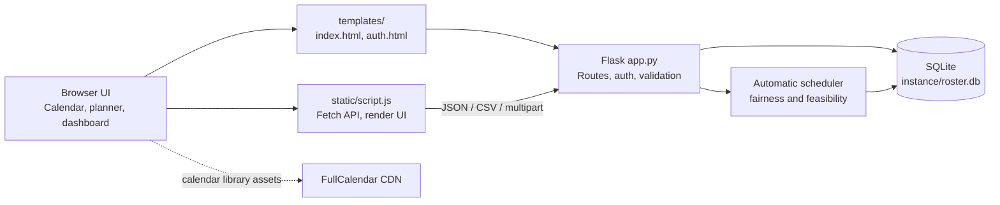
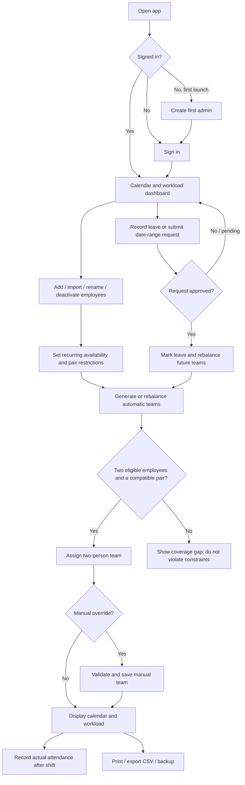
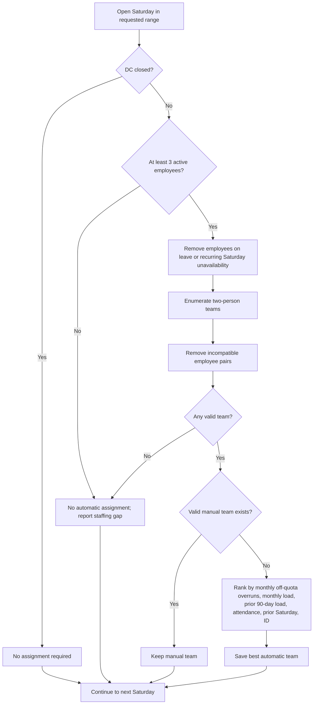
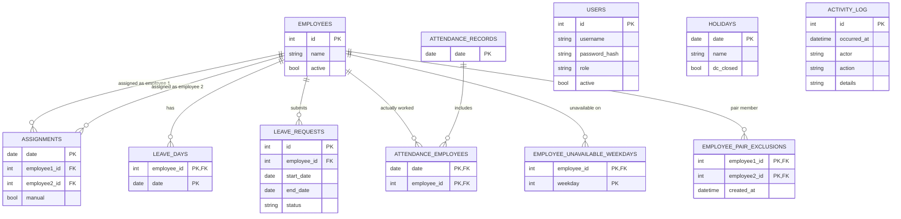

# Saturday DC Roster

A local web application for planning Saturday staffing at a distribution centre
(DC). It combines a month/agenda calendar, employee and leave management,
automatic fair rotation, manual controls, attendance tracking, scenario
previews, CSV exports, activity history, and SQLite backups.

The roster requires at least **three active employees** before scheduling. Each
open Saturday requires **two different employees**. Automatic rotation targets
at least **two Saturdays off per employee in each month** while preserving
two-person coverage. When the available staff, approved leave, recurring
unavailability, pairing restrictions, or a manual override make every target
impossible, the app keeps two-person coverage where possible, minimizes quota
overruns, and reports the shortfall. A fourth available employee is needed to
meet the two-Saturdays-off target in a typical four- or five-Saturday month.

## Contents

- [Features](#features)
- [Requirements and local setup](#requirements-and-local-setup)
- [First-run and accounts](#first-run-and-accounts)
- [Everyday workflow](#everyday-workflow)
- [How automatic scheduling works](#how-automatic-scheduling-works)
- [Diagrams](#diagrams)
- [Data model](#data-model)
- [CSV, print, and backups](#csv-print-and-backups)
- [Configuration and deployment](#configuration-and-deployment)
- [API overview](#api-overview)
- [Tests](#tests)
- [Project layout](#project-layout)

## Features

- **Calendar:** month grid and agenda views, month navigation, employee
  color-coding, Saturday team display, leave and attendance indicators, and
  closed/operating holiday markers.
- **Automatic roster:** two distinct employees on each open Saturday; balances
  current-month assignment counts, protects the monthly Saturday-off target
  where staffing allows, and uses recent assignments, actual attendance, and
  previous-Saturday work to break ties.
- **Manual planning:** select a Saturday to override its team, mark or unmark
  leave, select substitutes, record attendance, or return an eligible future
  assignment to automatic rotation.
- **Availability and constraints:** recurring unavailable weekdays and
  employee pair restrictions are applied to automatic teams and manual
  assignments. Infeasible dates are surfaced as coverage gaps rather than
  silently violating those constraints.
- **Leave workflow:** direct leave entries, pending/approved/rejected date-range
  requests, one-request-at-a-time coverage forecasts, and bulk CSV import of
  approved leave.
- **Employee lifecycle:** add, rename, deactivate, reactivate, bulk CSV import,
  and roster CSV export. Deactivation preserves historical identity and
  assignments.
- **Attendance and workload:** track who actually worked (including
  substitutes), separately from who was scheduled; see assigned, off, and
  worked Saturday counts and imbalance warnings.
- **What-if planning:** simulate a leave date or an employee addition/removal
  in an isolated in-memory database copy; previews do not change the live
  roster.
- **Operations and safety:** paginated/searchable activity history, complete
  activity CSV export, calendar CSV export, browser print-to-PDF, and validated
  SQLite backup/restore with a pre-restore safety copy.
- **Accounts:** first-run administrator setup and administrator, operator,
  and read-only viewer roles.

## Requirements and local setup

Requirements:

- Python 3.10 or newer.
- A modern browser.
- Network access to the FullCalendar CDN on first use unless the browser has
  already cached its assets.

From PowerShell in the project directory:

```powershell
py -3 -m venv .venv
.\.venv\Scripts\Activate.ps1
python -m pip install -r requirements.txt
python app.py
```

If PowerShell prevents activation, invoke the virtual-environment interpreter
directly instead:

```powershell
.\.venv\Scripts\python.exe -m pip install -r requirements.txt
.\.venv\Scripts\python.exe app.py
```

Open <http://127.0.0.1:5000>. On first launch, create the administrator account.
Then add at least three active employees to enable scheduling.

The application uses Flask and SQLite. Python dependencies are listed in
[`requirements.txt`](requirements.txt); FullCalendar is loaded from its
published CDN link in the main template. No Node.js build step is required.

## First-run and accounts

1. The first person opening the app completes `/setup` and creates the initial
   administrator. Passwords must have at least 12 characters; only password
   hashes are stored.
2. Sign in to manage the roster. Administrators can create users and set their
   role in **User accounts**.
3. Administrators and operators can manage roster data. Viewers can read but
   cannot make changes. Only administrators can manage accounts and backups.
4. Sign out when finished. Sessions expire after eight hours.

All mutating web requests require a session-bound CSRF token. The activity log
attributes changes to the signed-in account.

## Everyday workflow

### 1. Build the active employee roster

- Add employees individually or use **Import employees from CSV**. The
  employee template contains a single `Name` column. An import can contain up
  to 500 rows.
- Duplicate names in the file and names already active are skipped; a match
  for an inactive employee reactivates that existing employee record.
- Rename an employee without changing the employee ID, so historical
  assignments remain connected to the same person.
- Remove an employee to deactivate them. The app does not allow the active
  roster to drop below three employees. Existing history is retained.
- Use **Export roster CSV** to download IDs, names, and active status.

### 2. Set availability and team rules

- Use the date planner to set recurring unavailable weekdays for an employee.
  Marking Saturday unavailable prevents that person from automatic Saturday
  assignments.
- Use **Team pairing restrictions** when two employees must not be assigned
  together. The pair is excluded from automatic scheduling, manual assignment,
  and substitute recommendations.
- A new pair restriction is rejected if it conflicts with an existing future
  manual assignment. If no eligible pair remains for a date, the calendar and
  summary report a coverage gap.

### 3. Plan the calendar and handle leave

- Browse the month grid or switch to agenda view. Select a date to edit the
  available planner controls; select a Saturday to manage its team and leave.
- A direct leave entry makes that employee unavailable for the date and
  triggers a rebalance of upcoming automatic assignments.
- For a planned absence, submit a date-range request under **Leave requests**.
  A request stays pending and does not alter the roster until approved.
- Approving a request records leave for every date in its range and rebalances
  future automatic assignments. Rejecting it leaves assignments unchanged.
  Overlapping pending or approved requests for the same employee are rejected.
- Each pending request displays its own forecast of future open Saturdays
  that would have fewer than two available staff after approval. Forecasts are
  calculated per request and do not combine multiple pending requests.
- Bulk approved leave can be imported from a UTF-8 CSV with `Employee,Date`
  columns. Dates use `YYYY-MM-DD`; import rows are validated before changes
  are committed.
- If a person marked on leave actually works, unmark their leave in the
  Saturday planner. The app clears the leave entry and makes them eligible for
  the normal future rotation.

### 4. Review or override Saturday teams

- The scheduler assigns two distinct people for each open Saturday when at
  least three active employees are present and a feasible team exists.
- To override a team, select the Saturday, choose the two employees, and save.
  Manual choices must be active, available, and compatible with pairing
  restrictions.
- Substitute suggestions are ranked using scheduled workload and actual
  attendance in the month, followed by recent Saturday work. A suggestion
  changes the planner selection only; save the assignment to apply it.
- For today or a future Saturday, **Return to automatic rotation** clears a
  manual override and asks the scheduler to choose the team again. Past
  assignments cannot be changed this way. An override is retained if clearing
  it would leave no valid two-person team.
- Closed Saturdays require no team. An open holiday is staffed as a normal
  Saturday.

### 5. Record attendance and monitor fairness

- After the shift, use **Actual attendance** in the Saturday planner to record
  who really worked, including substitutes who were not on the scheduled
  team.
- Attendance is stored separately from the planned assignment and is visible
  in the calendar and roster CSV export.
- The workload panel shows assigned Saturdays, Saturdays off, and actual
  Saturdays worked for the visible calendar period. Alerts identify coverage
  gaps, a monthly Saturday-off shortfall, scheduled imbalance, or an actual
  attendance imbalance.

### 6. Preview changes before applying them

- **What-if leave preview** recalculates assignments and workload if a selected
  employee is hypothetically unavailable on a Saturday.
- **Preview employee change** simulates adding or removing one employee from
  the selected Saturday onward and compares upcoming teams, workload, and
  coverage gaps over 90 days.
- Both previews operate on an in-memory database copy. They do not modify live
  assignments, leave, employee records, or activity history.

## How automatic scheduling works

The scheduler follows these priorities:

1. Do not schedule on a closed Saturday.
2. Require two different active employees who are not on leave and are not
   marked unavailable on Saturday.
3. Exclude any pair configured as incompatible.
4. Preserve a valid manual assignment. Invalid future manual teams are replaced
   by an automatic team when a feasible team exists.
5. Among automatic candidate teams, minimize the number of assignments that
   exceed the per-employee monthly limit (`calendar Saturdays in the month - 2`).
   This is the scheduler's way to target at least two Saturdays off for each
   employee.
6. Break remaining ties using the monthly assignment counts, assignments in
   the preceding 90 days, actual attendance this month, avoidance of the
   previous Saturday, and employee ID.

The monthly off target is a target under constraints, not permission to leave
the DC understaffed. In a four-Saturday month, there are eight assignment
slots; in a five-Saturday month, there are ten. Four available employees are
needed to give everyone at least two Saturdays off in either case. With only
three employees, ten slots must be distributed among three people in a
five-Saturday month, so someone necessarily works four Saturdays and gets
only one Saturday off. The app warns about the shortfall and still attempts to
staff every open Saturday with two employees.

Manual assignments are honored even if they exceed the monthly off target.
The scheduler does not rewrite a valid manual choice just to improve fairness.
Availability, leave, pairing restrictions, holidays, and the active-employee
minimum may also make the off target infeasible.

## Diagrams

### Application architecture



The app is a single Flask process by default, with browser-side interaction in
JavaScript and persistent roster data in SQLite. What-if endpoints use a
temporary in-memory copy instead of modifying the persistent database.

### Main roster and leave workflow



### Automatic team selection



### Data relationships



`USERS`, `HOLIDAYS`, and `ACTIVITY_LOG` are independent tables in the current
schema. Employee names can change, but employee IDs remain stable.

## CSV, print, and backups

- **Calendar CSV:** use **Export CSV** for the currently visible calendar
  period. It includes planned assignments, leave, and attendance fields.
- **Employee CSV:** use **Export roster CSV** for employee ID, name, and active
  status.
- **Activity CSV:** **Export CSV** in Activity History downloads the complete
  history, not just the currently displayed page. History can be searched,
  filtered by event date, and browsed 20 entries per page.
- **Import employees:** UTF-8 CSV, one employee name per row, optional `Name`
  header, maximum 500 nonblank rows, maximum name length 80 characters.
- **Import leave:** UTF-8 CSV with `Employee,Date` headers, active employee
  names, ISO dates (`YYYY-MM-DD`), maximum 500 rows. Invalid data rejects the
  import rather than partially applying it; duplicate entries and leave
  already recorded are skipped.
- **Print/PDF:** use **Print calendar** and the browser's print dialog, then
  choose **Save as PDF**.
- **Backup:** use **Download backup** in Data Safety to download a consistent
  SQLite database copy.
- **Restore:** choose a compatible app backup and confirm replacement. The app
  validates the SQLite file and required schema, then creates a safety copy
  beside the configured database before replacing it. Keep the safety copy
  until the restored roster has been checked. Uploads are limited to 64 MB.

Activity history records signed-in user actions such as employee, leave,
assignment, holiday, attendance, and restore changes. A restore is recorded in
the restored database; pre-restore history remains in the safety backup.

## Configuration and deployment

| Setting | Purpose | Default |
|---|---|---|
| `ROSTER_DATABASE` | SQLite database file path | `instance/roster.db` |
| `ROSTER_SECRET_KEY` | Flask session-signing secret | Generated and stored in `instance/.session-secret` |
| `ROSTER_COOKIE_SECURE` | Set to `1` to require HTTPS for session cookies | Disabled for local HTTP |
| `PORT` | Local Flask listen port | `5000` |

For local use, the app binds to `127.0.0.1` and uses Flask's development
server. Keep `instance/roster.db` and `instance/.session-secret` private and
include them in a secure backup process; neither should be committed to source
control.

For access from other devices, deploy behind a production WSGI server and an
HTTPS reverse proxy. Configure the same long, random `ROSTER_SECRET_KEY` on
every app worker and set `ROSTER_COOKIE_SECURE=1`. Do not expose Flask's
development server directly to the public internet. SQLite is suitable for
this single-app local workflow; assess database concurrency and operational
requirements before using it for a multi-worker network deployment.

## API overview

The browser uses Flask JSON endpoints. All API routes require sign-in; mutating
requests additionally require a valid CSRF token. Viewer accounts cannot call
mutation endpoints. Account and backup/restore routes are administrator-only.

| Area | Main endpoints |
|---|---|
| Calendar and summary | `GET /api/calendar`, `GET /api/summary`, `GET /api/export.csv` |
| Employees | `GET/POST /api/employees`, `PATCH/DELETE /api/employees/<employee_id>`, `POST /api/employees/import`, `GET /api/employees/export.csv` |
| Availability and pair restrictions | `GET/PUT /api/employees/<employee_id>/availability`, `GET/POST /api/pair-exclusions`, `DELETE /api/pair-exclusions/<employee1_id>/<employee2_id>` |
| Leave | `GET/POST/DELETE /api/leave`, `GET/POST /api/leave-requests`, `PATCH /api/leave-requests/<request_id>`, `POST /api/leave/import` |
| Assignments and substitutes | `POST/DELETE /api/assignments/<date>`, `GET /api/substitutes/<date>` |
| Attendance | `GET /api/attendance`, `PUT /api/attendance/<date>` |
| Holidays | `GET /api/holidays`, `PUT/DELETE /api/holidays/<date>` |
| What-if previews | `GET /api/simulate/leave`, `GET /api/simulate/roster` |
| Activity | `GET /api/activity`, `GET /api/activity.csv` |
| Accounts and database safety | `GET/POST /api/users`, `PATCH /api/users/<user_id>`, `GET /api/backup`, `POST /api/restore` |

Date-range endpoints use ISO dates. Calendar/summary ranges use `start` and
`end`, where `end` is exclusive and the maximum range is 370 days.

## Tests

Run the test suite from the project directory:

```powershell
python -m unittest discover -s tests
```

Check the browser script syntax:

```powershell
node --check static\script.js
```

## Project layout

```text
sat_app/
├── app.py                  # Flask routes, schema setup, scheduler, validation
├── requirements.txt        # Python dependencies
├── instance/
│   ├── roster.db           # Local SQLite data (created at runtime)
│   └── .session-secret     # Generated local session-signing secret
├── templates/
│   ├── auth.html           # First-admin setup and sign-in screens
│   └── index.html          # Calendar, roster panels, and dialogs
├── static/
│   ├── script.js           # Browser interactions and API calls
│   └── style.css           # Responsive application styles
└── tests/
    └── test_app.py         # Flask API, scheduling, and workflow tests
```
